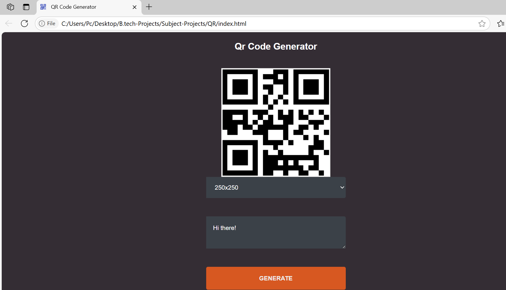

# 🧾 QR Code Generator

A simple and responsive QR Code Generator built with **HTML**, **CSS**, and **JavaScript**.  
It allows users to generate QR codes for any input text or URL in various sizes using a free online API.



## 🚀 Live Demo

🔗 [Click here to view it live](https://khushi0389.github.io/qr-code-generator/)

## ✨ Features

- Generate QR code instantly from text or links
- Select QR size: 100x100 to 300x300
- Clean and dark-themed UI
- Mobile responsive
- Uses a reliable external API (https://api.qrserver.com)

## 📂 Project Structure

qr-code-generator/
├── index.html # Main HTML file
├── README.md # Project documentation
└── (Optional assets like CSS or favicon)


## 🛠️ How to Use Locally

1. Clone the repository:
   ```bash
   git clone https://github.com/Khushi0389/qr-code-generator.git
Open index.html in any browser.

No build tools or servers required — it’s pure static!

🌐 Hosting
This project is hosted using GitHub Pages
🔗 https://khushi0389.github.io/qr-code-generator

🧑‍💻 Developed & Maintained By
      Khushi Gupta

📌 Feel free to fork or use this project as a starter template!


